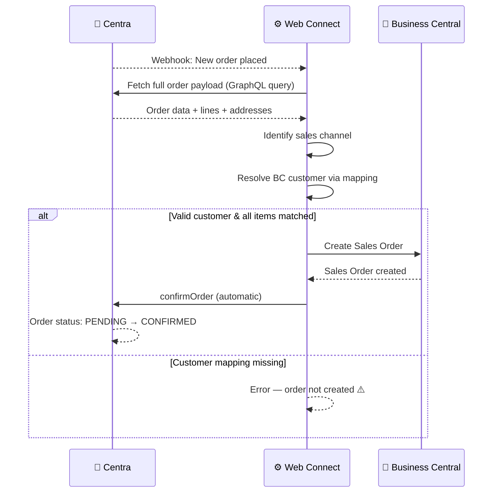

# Order — Inbound Flow

**Direction:** Centra → BC
**Purpose:** Receive orders from Centra and create Sales Orders in Business Central.

---

## Overview

When a customer places an order in Centra, the platform sends a webhook event to Web Connect. Web Connect fetches the full order details, determines the correct BC customer based on the sales channel and market, and creates a Sales Order in BC. The order is then automatically confirmed in Centra to indicate that it has been received and is ready for processing.

---

## How It Works

**Trigger:** Webhook event from Centra when a new order is placed
**Acknowledgment:** Automatic confirmation sent back to Centra

**Objects used:**

| Object | Role |
|---|---|
| `CA_NEW_ORDER_EVENT` | Webhook listener — receives order notifications |
| `CA_ORDER` | Fetches full order payload (header and lines) |
| `CA_BILLINGADDRESS` | Billing address details |
| `CA_SHIPPINGADDRESS` | Delivery address details |
| `CA_LINES` | Order line items (product, quantity, price) |

**Process steps:**

1. Customer places order in Centra
2. Centra sends webhook → Web Connect (`CA_NEW_ORDER_EVENT`)
3. Web Connect fetches the full order payload
4. Sales channel identified via conditions (e.g. DTC Retail, Wholesale, Consignment)
5. BC customer resolved using market/channel mappings
6. Sales Order created in BC with order lines
7. Order confirmation sent automatically → Centra status: PENDING → CONFIRMED
8. Order is now ready for warehouse to pick, pack, and ship

**Sequence diagram:**

---

## Order Confirmation

Order confirmation is **automatic** — it happens immediately after the Sales Order is created in BC:

- No manual confirmation step required
- Centra receives the confirmation and updates the order status to `CONFIRMED`
- This signals that BC is ready to process the order

---

## Order Lifecycle

Once the order is confirmed in BC:

1. **CONFIRMED** → Warehouse picks and packs the order
2. **PROCESSING** → First shipment is created and sent to Centra
3. **COMPLETED** → All order lines have been shipped

If an order needs to be cancelled:

- Cancellation can happen at any stage
- Status moves to `CANCELLED`
- See [Cancellation](cancellation.md) flow for details

---

## Variants

### Variant A — DTC / B2C Orders

Retail/B2C orders from Centra's store. Customer is resolved via a market-to-BC-customer mapping.

Example: Centra market "Sweden Web" → maps to BC customer "WEBSE"

### Variant B — Wholesale / B2B Orders

Wholesale orders placed by B2B accounts. Customer details may be fetched from account data in the order payload.

### Variant C — Consignment / Marketplace Orders

Orders from third-party marketplaces (e.g. Åhléns, Zalando). Each marketplace may require its own channel condition and customer mapping.

---

## Configuration Notes

- **Channel identification:** Set up conditions to distinguish between different sales channels (retail, wholesale, marketplace)
- **Customer mapping:** Create a mapping from Centra market IDs to BC customer numbers
- **Item matching:** Configure how items in Centra orders are matched to BC items (typically via EAN or product ID)
- **Webhook registration:** Centra webhooks must be registered in the platform and point to your Web Connect instance

---

## Error Handling

| Step | What can go wrong | What happens |
|---|---|---|
| Webhook delivery | Network issue or Web Connect unavailable | Centra retries; order may be delayed |
| Fetching order data | Centra API error | Web Connect retries; order processing delayed |
| Channel identification | Unknown store/market condition | Order not created; logged with error |
| Customer lookup | Market ID not in mapping | Sales Order creation fails; error logged |
| Creating Sales Order | BC validation error (missing dimension, invalid item) | Order remains in PENDING; manual intervention needed |
| Sending confirmation | Centra API unavailable | Confirmation may fail; order stays PENDING in Centra |

---

**Related:**
[Overview](../overview.md) · [Shipment](shipment.md) · [Authentication](../authentication.md)
