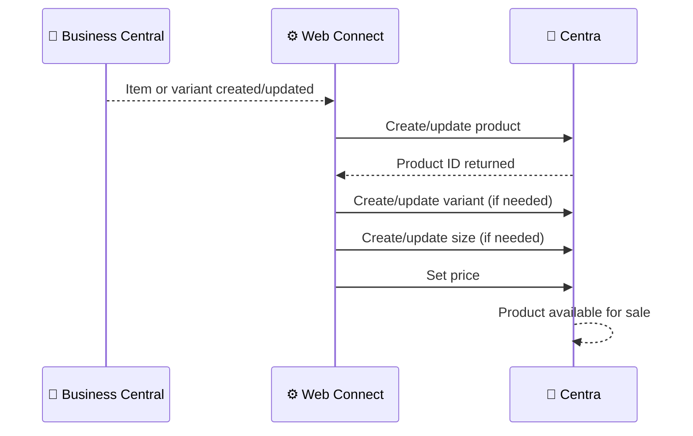

# Product Data Flow

**Direction:** BC → Centra
**Purpose:** Sync product, variant, and pricing information from Business Central to Centra (optional).

---

## Overview

This flow is **optional** and used only when Business Central is the master for product data. If enabled, it synchronizes items, variants, sizes, and prices to Centra whenever they are created or updated in BC.

Many customers manage products directly in Centra and do not need this flow. It is most useful when:

- BC is the system of record for product catalog and pricing
- Products must be available in Centra automatically after creation in BC
- Price changes in BC should immediately reflect in Centra

---

## How It Works

**Trigger:** Automatic — item/variant/price changes in BC (configurable)
**API operations:** Create/update product, variant, size, and price in Centra

**Objects used:**

| Object | Role |
|---|---|
| `CA_PRODUCT` | Creates or updates product in Centra |
| `CA_VARIANT` | Creates or updates product variant (e.g. color) |
| `CA_SIZE` | Creates or updates size/dimension (e.g. S, M, L) |
| `CA_PRICE` | Creates or updates price for the product/variant/size combination |

**Process steps:**

1. Item or item variant is created or modified in BC
2. Web Connect detects the change
3. Product is created or updated in Centra with base information (name, description, EAN)
4. Variant is created or updated (if variants are used)
5. Size is created or updated (if applicable)
6. Price is synced from the configured BC pricelist
7. Product becomes available in Centra for sales

**Sequence diagram:**



---

## Product Hierarchy

Centra uses a hierarchical structure:

```
Product
  ├─ Variant (e.g. color: Red, Blue)
  │   ├─ Size (e.g. S, M, L)
  │   └─ Price
  └─ Variant (e.g. color: Green)
      ├─ Size (e.g. S, M, L)
      └─ Price
```

Business Central item structure must be mapped to this hierarchy:

- **Product** ← BC Item
- **Variant** ← BC Item Variant Code (color, style, etc.)
- **Size** ← BC Item Variant Code (size) or custom dimension
- **Price** ← BC Item price from configured pricelist

---

## Important: Size Charts

In Centra, once a **Size Chart** is assigned to a product, it **cannot be changed without deleting and recreating the product**. This is a Centra platform limitation.

**Implication:** Size structure must be correctly planned before the product is published in Centra. Changes to the size set after go-live require manual intervention.

---

## Variants

### Variant A — Simple Product (No variants or sizes)

Products without color/size variants are created as a single product with one price.

### Variant B — Color + Size Product

Products with color variants and multiple sizes (e.g. clothing). Each color-size combination gets its own price.

### Variant C — Variant-only (No size dimension)

Products have variants (e.g. different styles) but no size variants. Common for shoes, where style is the variant.

---

## Configuration Notes

- **Item scope:** Decide which BC items should be synced to Centra (e.g. only items with a specific flag)
- **Pricelist selection:** Which BC pricelist should be used for pricing? (typically a sales pricelist)
- **Variant mapping:** How BC item variants map to Centra variants (color, size, style, etc.)
- **Taxonomy/categories:** Should products be assigned to categories in Centra?
- **Updates only or full sync:** Should only changes be synced, or periodic full re-sync?

---

## Error Handling

| Step | What can go wrong | What happens |
|---|---|---|
| Detecting item change | Item table monitoring not configured | Item never synced to Centra |
| Creating product | Item missing required fields (EAN, description) | Sync fails; logged with error |
| Creating variant | Invalid variant code | Sync fails; Centra rejects the variant |
| Setting price | Pricelist item not found | Price sync fails; product created without price |
| Updating product | Size chart already assigned | Size changes rejected; product must be recreated in Centra |

---

## When NOT to Use This Flow

- Centra is the master for products (products should be created in Centra first)
- Products need rich content (images, SEO, category hierarchy) that is better managed in Centra's UI
- Stock-only sync is needed (use [Stock Update](stock-update.md) instead)
- Product changes are infrequent and manual updates to Centra are acceptable

---

**Related:**
[Overview](../overview.md) · [Stock Update](stock-update.md) · [Authentication](../authentication.md)
