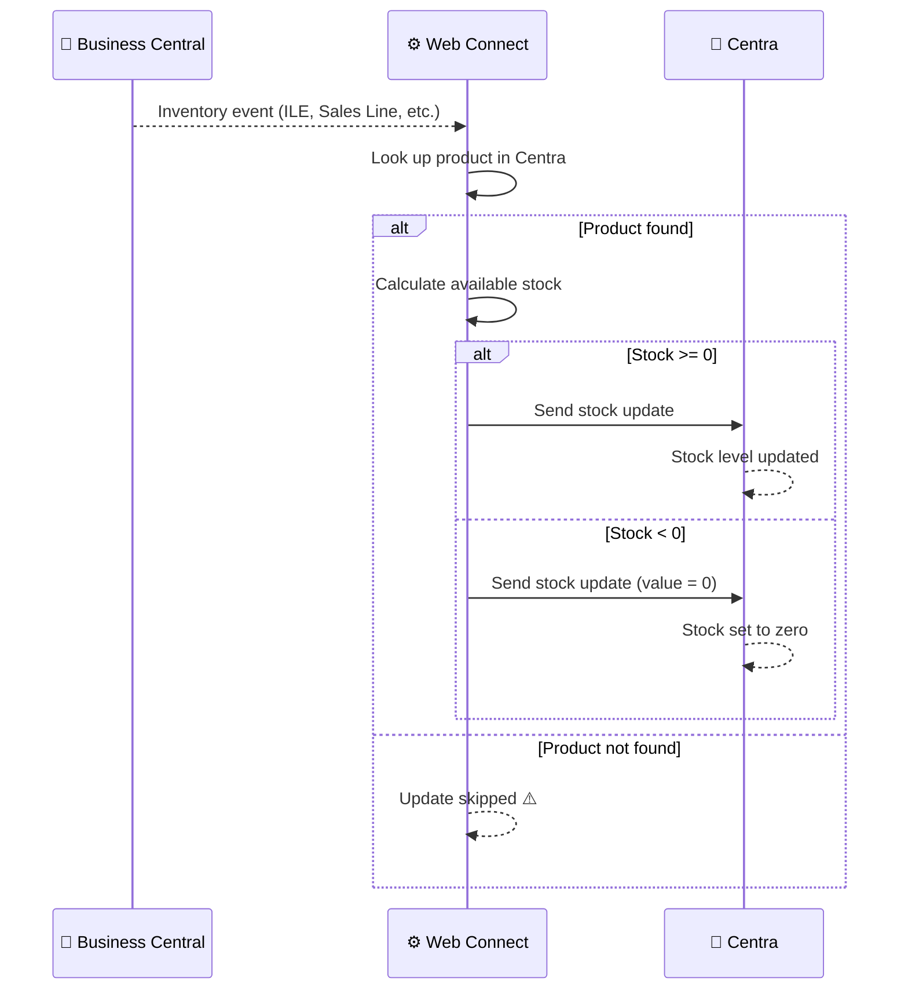

# Stock Update Flow

**Direction:** BC → Centra
**Purpose:** Keep stock levels in Centra in sync with available inventory in Business Central.

---

## Overview

Centra displays stock levels to customers when they browse products. To ensure accurate availability information, stock levels must be synchronized from Business Central to Centra whenever inventory changes. This happens automatically whenever items are purchased, received, transferred, or adjusted.

---

## How It Works

**Trigger:** Automatic — inventory changes in BC (sales orders, purchases, transfers, adjustments)
**API operation:** Stock update mutation via GraphQL

**Objects used:**

| Object | Role |
|---|---|
| `CA_STOCKUPDATE` | Sends updated stock level to Centra |

**Triggered by (Web Connect monitors these):**

| BC Table | Event | Why |
|---|---|---|
| Item Ledger Entry | After posting | Inventory decreases when sales ship; increases when purchases arrive |
| Sales Line | Line created/modified | Available stock decreases when order is created |
| Purchase Line | Line created/modified | Available stock increases when purchase is scheduled |
| Transfer Line | Line created/modified | Inventory allocated between locations |

**Process steps:**

1. Inventory event occurs in BC (sales order created, shipment posted, purchase received, etc.)
2. Web Connect detects the change
3. Product is identified in Centra using a product lookup (typically EAN → Centra product ID)
4. Current available stock is calculated in BC
5. If stock is negative → `0` is sent (Centra does not accept negative values)
6. Stock level is sent to Centra via GraphQL mutation

**Sequence diagram:**

---

## Stock Calculation

The stock sent to Centra represents **available inventory**:

- Starting point: Item quantity on hand in BC
- Minus: Quantities reserved by sales orders and transfers
- Result: Free/available quantity

**Negative stock handling:** If calculated stock is below zero, `0` is sent to Centra instead. This prevents negative inventory from being displayed to customers.

---

## Product Lookup

Each product in Centra must be mapped to a BC item using a **product identifier** (usually EAN or product number):

- The product lookup must be configured in Web Connect
- Without a valid lookup, the stock update is silently skipped
- Stock in Centra remains unchanged if the product cannot be matched

---

## Variants

### Variant A — EAN-based Lookup (Standard)

Items are matched using EAN codes. The EAN is looked up in a configured mapping to find the Centra product ID.

### Variant B — Product Code Lookup

Items are matched using internal product codes or SKUs instead of EAN.

### Variant C — Warehouse-specific Stock

Stock is calculated per warehouse and sent separately for each location in Centra. Used when Centra tracks inventory per fulfillment location.

---

## Configuration Notes

- **Negative stock:** Always sent as `0` — Centra does not display or accept negative inventory
- **Update frequency:** Web Connect processes changes with a short delay (typically seconds to minutes)
- **Scope:** Only products with a valid product lookup are synced; others are skipped silently
- **Warehouses:** Configure which BC locations/warehouses should be included in the stock calculation

---

## Error Handling

| Step | What can go wrong | What happens |
|---|---|---|
| Detecting change | Item Ledger Entry not being posted | Change goes undetected; stock not updated |
| Detecting change | Web Connect monitoring not configured | Stock changes are never sent to Centra |
| Product lookup | EAN not found in mapping | Update skipped; Centra stock unchanged |
| Product lookup | Incorrect lookup value | Update sent to wrong product in Centra |
| Sending update | Centra API error | Job Queue entry fails; retried on next run |
| Sending update | Network timeout | Job Queue entry fails; retried on next run |

---

**Related:**
[Overview](../overview.md) · [Product Data](product-data.md) · [Authentication](../authentication.md)
