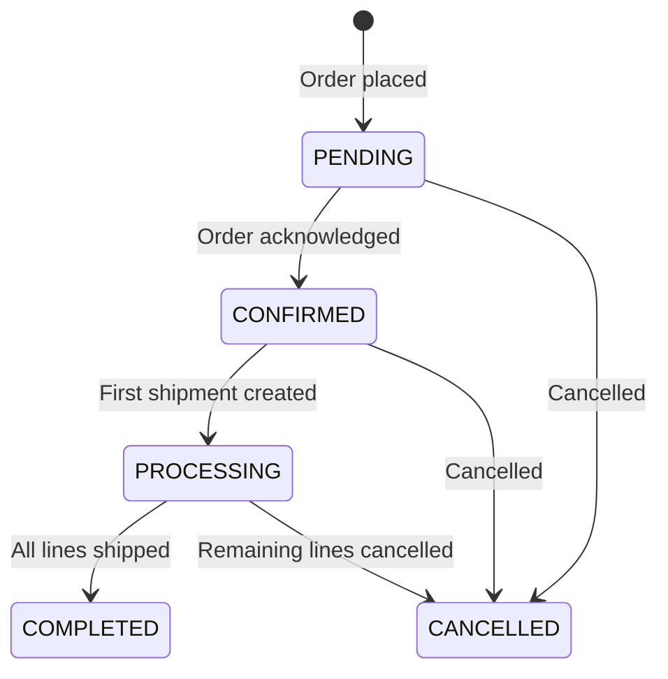
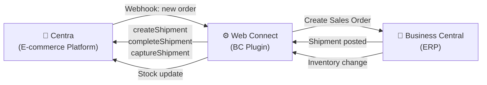

# Centra — Integration Overview

## What is Centra?

Centra is a modern e-commerce platform used to manage online retail stores and sales channels. It provides a central point for managing products, orders, inventory, and customer interactions across multiple sales channels (web stores, marketplaces, wholesale, consignment).

**API reference:** [Centra GraphQL Integration API](https://docs.centraapis.com/)
**API version used:** GraphQL
**Authentication:** Integration API tokens (managed in Centra AMS)

---

## Available Flows

| Flow | Direction | Description |
|---|---|---|
| [Order — Inbound](flows/order-inbound.md) | Centra → BC | Receive orders from Centra and create Sales Orders in BC |
| [Shipment](flows/shipment.md) | BC → Centra | Notify Centra when orders are shipped |
| [Stock Update](flows/stock-update.md) | BC → Centra | Keep stock levels in sync |
| [Cancellation](flows/cancellation.md) | BC → Centra | Cancel orders in Centra from BC |
| [Product Data](flows/product-data.md) | BC → Centra | Sync product and pricing information (optional) |

---

## Order Status Lifecycle

| Status | Meaning |
|---|---|
| **PENDING** | Order received but not yet confirmed |
| **CONFIRMED** | Order acknowledged; ready for processing |
| **PROCESSING** | Partial or full shipment has been created |
| **COMPLETED** | All order lines have been shipped |
| **CANCELLED** | Order or remaining lines cancelled |

---

## Integration Architecture

Centra connects to Business Central via Web Connect (a BC plugin). Web Connect handles:

- **Inbound orders:** Webhook events from Centra → Sales Orders in BC
- **Outbound updates:** Changes in BC (shipments, stock, products) → Centra API calls
- **Authentication:** Secure storage and rotation of Centra API tokens

---

## Master Data Ownership

| Data | Master | Direction |
|---|---|---|
| **Orders** | Centra | Centra → BC |
| **Stock levels** | BC | BC → Centra |
| **Products** (optional) | BC | BC → Centra |
| **Customers** | Centra | Centra → BC |
| **Markets & channels** | Centra | (configuration only) |
| **Payments** | Centra | (PSP captured by Centra) |

---

## Sales Channels

Centra organizes sales into **Stores** and **Markets**:

- **Store:** The type of sale (e.g. "Retail" for B2C, "Wholesale" for B2B)
- **Market:** The region or sales channel (e.g. SE, NO, UK, specific marketplace)

Each combination may require different routing and mapping in BC.

---

## Authentication

All flows use **Centra Integration API tokens** stored securely in Web Connect. See [Authentication](authentication.md) for details.

---

## Configuration Highlights

When implementing Centra ↔ BC, key decisions include:

- **Which flows** to enable (Order + Stock is standard; Products and Cancellation are optional)
- **Which sales channels** exist and how to identify them
- **Customer mapping** — which BC customer per Centra market
- **Financial mappings** — VAT groups, payment methods, shipping agents per country
- **Shipping fee handling** — how inbound shipping costs are posted in BC (G/L account, item, or charge — configured in Web Connect Codeunit Setup)
- **Stock calculation** — which warehouses and whether to include reserved stock

---

## Related

[Authentication](authentication.md) · [Flows](flows/) · [Centra API Documentation](https://docs.centraapis.com/)
