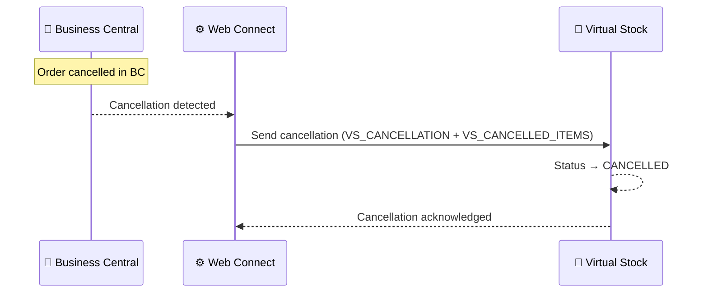

# Cancellation Flow

**Direction:** BC → Virtual Stock
**Purpose:** Cancel an acknowledged order in Virtual Stock when it can no longer be fulfilled.

---

## Overview

If an order that has already been confirmed (status `PROCESSING`) needs to be cancelled, a cancellation notification must be sent to Virtual Stock. This updates the order status in Virtual Stock to **CANCELLED** and informs the retailer.

Cancellations can only be sent for orders that have been acknowledged. Orders still in `PENDING` status can be left unfulfilled without a formal cancellation, but it is good practice to always communicate.

> Note: If the retailer cancels the order from their side, the order status in Virtual Stock becomes `CANCEL`. This is a separate scenario — see [Order — Inbound](order-inbound.md) for how to handle incoming cancellation requests.

---

## Variants

### Variant A — Automatic via BC cancellation (Standard)

When an order is cancelled in BC, Web Connect automatically sends a cancellation notification to Virtual Stock.

**Trigger:** Automatic — order cancellation in BC (exact trigger to be confirmed per customer)
**Objects used:**

| Object | Role |
|---|---|
| `VS_CANCELLATION` | Parent — sends cancellation to Virtual Stock |
| `VS_CANCELLED_ITEMS` | Sub — cancelled order lines |

**Process steps:**

1. Order is cancelled in Business Central
2. Web Connect detects the cancellation
3. Cancellation payload built using `VS_CANCELLATION` + `VS_CANCELLED_ITEMS`
4. Cancellation sent to Virtual Stock
5. Virtual Stock updates order status to `CANCELLED`

**Sequence diagram:**

---

### Variant B — Manual cancellation via Virtual Stock portal

A cancellation can be submitted manually via the Virtual Stock portal, used when the automatic flow is not available or as a fallback during incidents.

---

## Configuration Notes

- **Partial cancellations:** Virtual Stock supports cancelling individual order lines; full vs. partial cancellation behaviour depends on customer setup
- **Timing:** Cancellations can only be sent while the order is in `PROCESSING` status — not after dispatch
- **Retailer-initiated cancellations:** If the retailer cancels (order status becomes `CANCEL` in VS), this must be handled in BC separately — the supplier must respond with either a confirmation of cancellation or, if already dispatched, notify accordingly

---

## Error Handling

| Step | What can go wrong | What happens |
|---|---|---|
| Detecting cancellation | WC trigger not configured | Cancellation notification never sent; order stays PROCESSING in VS |
| Sending cancellation | VS API error | Job Queue entry fails; retry on next run |
| Sending cancellation | Auth error (401/403) | Token refresh attempted; if fails, check auth config |
| Sending cancellation | Order already dispatched | VS may reject the cancellation |

---

**Related:**
[Overview](../overview.md) · [Order — Inbound](order-inbound.md) · [Order Confirmation](order-confirmation.md) · [Authentication](../authentication.md)
