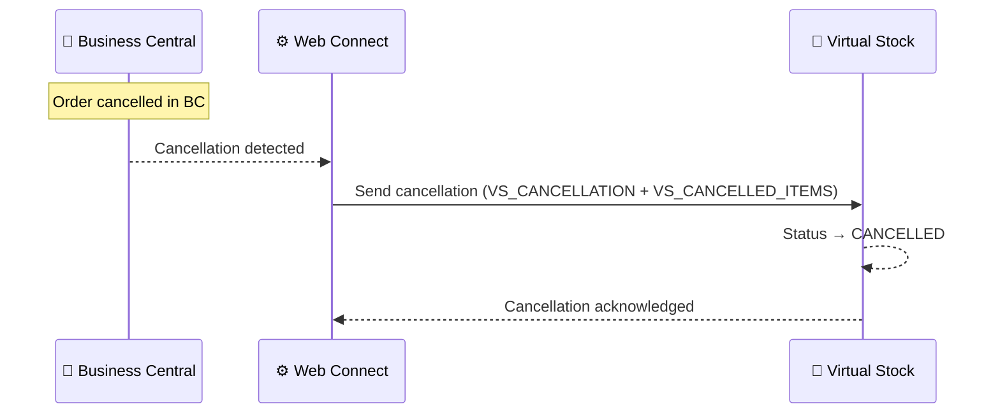

# Cancellation Flow

**Direction:** BC → Virtual Stock
**Purpose:** Cancel an acknowledged order in Virtual Stock when it can no longer be fulfilled.

---

## Overview

If an order that has already been confirmed (status `PROCESSING`) cannot be fulfilled, a cancellation notification must be sent to Virtual Stock. This updates the order status to **CANCELLED** and notifies the retailer.

> **Note:** If the retailer initiates a cancellation, the order status in Virtual Stock becomes `CANCEL`. This is a separate scenario that must be handled in BC — the incoming status change is picked up during the next polling cycle.

---

## How It Works

**Trigger:** Automatic — triggered when an order is cancelled in BC
**Objects used:**

| Object | Role |
|---|---|
| `VS_CANCELLATION` | Parent — sends cancellation notification to Virtual Stock |
| `VS_CANCELLED_ITEMS` | Sub — cancelled order lines |

**Process steps:**

1. Order is cancelled in Business Central
2. Web Connect detects the cancellation
3. Cancellation payload built from `VS_CANCELLATION` + `VS_CANCELLED_ITEMS`
4. Cancellation sent to Virtual Stock
5. Virtual Stock updates order status to `CANCELLED`

**Sequence diagram:**

---

## Variants

### Variant A — Full order cancellation (Standard)

The entire order is cancelled. All lines included in `VS_CANCELLED_ITEMS`.

### Variant B — Partial line cancellation

Individual order lines are cancelled while others remain active. Supported by Virtual Stock; whether this is configured depends on customer setup.

---

## Configuration Notes

- **Timing:** Cancellations can only be sent while the order is still in `PROCESSING` status — not after dispatch
- **Retailer-initiated cancellations:** If the retailer cancels (order status becomes `CANCEL` in VS), this must be handled in BC separately — e.g. the Sales Order is put on hold or deleted

---

## Error Handling

| Step | What can go wrong | What happens |
|---|---|---|
| Detecting cancellation | Trigger not configured | Cancellation never sent; order stays `PROCESSING` in VS |
| Sending cancellation | VS API error | Job Queue entry fails; retry on next run |
| Sending cancellation | Auth error (401/403) | Token refresh attempted; if fails, check `VS_OAUTH` config |
| Sending cancellation | Order already dispatched | VS rejects the cancellation — cannot cancel after dispatch |

---

**Related:**
[Overview](../overview.md) · [Order — Inbound](order-inbound.md) · [Order Confirmation](order-confirmation.md) · [Authentication](../authentication.md)
