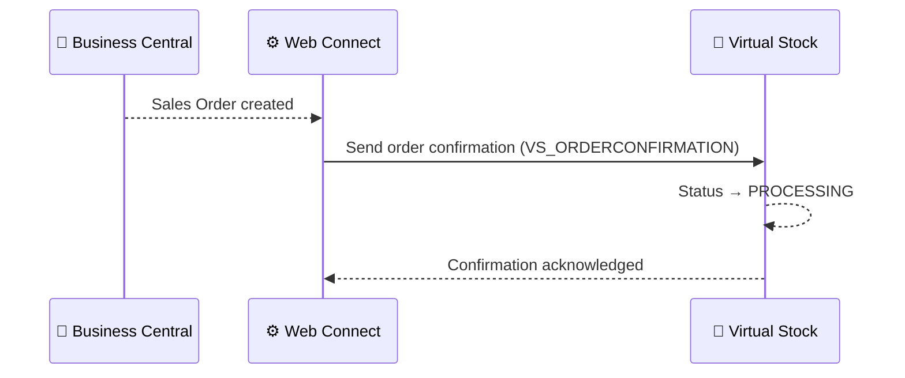

# Order Confirmation Flow

**Direction:** BC → Virtual Stock
**Purpose:** Acknowledge receipt of an order to Virtual Stock, moving its status from PENDING to PROCESSING.

---

## Overview

After a Sales Order has been created in BC (see [Order — Inbound](order-inbound.md)), an order confirmation is sent back to Virtual Stock. This tells Virtual Stock — and the retailer — that the supplier has received and accepted the order.

Virtual Stock moves the order status from **PENDING** to **PROCESSING** upon receipt of a valid confirmation.

---

## Variants

### Variant A — Automatic via Web Connect (Standard)

The order confirmation is sent automatically by Web Connect immediately after the Sales Order is created in BC. No manual action is required.

**Trigger:** Automatic — triggered by Sales Order creation in BC
**Objects used:**

| Object | Role |
|---|---|
| `VS_ORDERCONFIRMATION` | Parent — sends confirmation to Virtual Stock |
| `VS_CONFIRMATION_ITEM` | Sub — confirmed order lines |

**Process steps:**

1. Sales Order created in BC (from [Order — Inbound](order-inbound.md))
2. Web Connect detects new Sales Order
3. Confirmation payload built using `VS_ORDERCONFIRMATION` + `VS_CONFIRMATION_ITEM`
4. Confirmation sent to Virtual Stock
5. Virtual Stock updates order status to `PROCESSING`

**Sequence diagram:**

---

### Variant B — Manual confirmation

In cases where automatic confirmation is not configured, the confirmation can be sent manually from BC or directly via the Virtual Stock portal.

---

## Configuration Notes

- **Expected date:** The confirmation may include an expected dispatch/delivery date per line
- **Partial confirmation:** Virtual Stock supports confirming individual order lines separately; implementation depends on customer setup

---

## Error Handling

| Step | What can go wrong | What happens |
|---|---|---|
| Sending confirmation | VS API error | Job Queue entry fails; order stays `PENDING` in VS |
| Sending confirmation | Auth error (401/403) | Token refresh attempted; if fails, check auth config |
| Sending confirmation | Duplicate confirmation | VS may return error if already confirmed |

---

**Related:**
[Overview](../overview.md) · [Order — Inbound](order-inbound.md) · [Shipment / Dispatch](shipment.md) · [Cancellation](cancellation.md) · [Authentication](../authentication.md)
