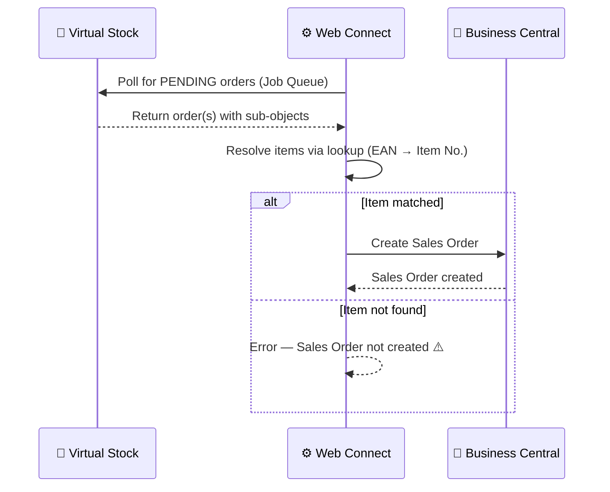

# Order — Inbound Flow

**Direction:** Virtual Stock → BC
**Purpose:** Fetch new orders from Virtual Stock and create them as Sales Orders in Business Central.

---

## Overview

Virtual Stock acts as an intermediary between retailers and suppliers. When a retailer places an order, Virtual Stock receives it and makes it available to the supplier (BC) with status **PENDING**. Web Connect polls Virtual Stock at regular intervals and creates a Sales Order in BC when a new order is found.

---

## Variants

### Variant A — Polling via Web Connect (Standard)

Web Connect polls Virtual Stock at regular intervals using the Job Queue. When one or more orders with status `PENDING` are found, Sales Orders are created in BC automatically.

**Trigger:** Job Queue — scheduled polling (interval configurable per customer)
**Item matching:** EAN barcode → BC Item No. (lookup required)

**Objects used:**

| Object | Role |
|---|---|
| `VS_ORDER` | Parent — fetches order header from Virtual Stock |
| `VS_ORDERITEMS` | Sub — order lines (quantity, item, price, promised date) |
| `VS_ADDRESS` | Sub — address data |
| `VS_SHIPPING_ADDRESS` | Sub — delivery address (name, address, postal code, country, email, phone) |
| `VS_RETAILER_DATA` | Sub — retailer info (name, address, email, phone, tax code, VS UUID) |

**Process steps:**

1. Web Connect polls Virtual Stock — fetches all orders with status `PENDING`
2. Sub-objects resolve to build the complete order payload
3. Item is matched to BC Item No. using the configured lookup (e.g. EAN-to-SKU)
4. Sales Order created in BC
5. Order confirmation sent automatically (see [Order Confirmation](order-confirmation.md))

**Sequence diagram:**

---

### Variant B — Manual import

Not currently a standard supported variant. Orders can be retrieved manually via the Virtual Stock portal and entered into BC by hand.

---

## Configuration Notes

- **Polling interval:** Configurable per customer via Job Queue
- **Item lookup:** Must be configured — see customer repo for specific lookup used
- **Order status filter:** Standard is `PENDING`; other statuses are not fetched

---

## Error Handling

| Step | What can go wrong | What happens |
|---|---|---|
| Polling | VS API unreachable | Job Queue fails; retried on next run |
| Polling | Auth error (401/403) | Token refresh attempted; if fails, check auth config |
| Item matching | EAN not found in BC | Sales Order creation fails |
| Sales Order creation | BC error | Job Queue entry fails with error message |

---

## Open Questions / Variants Not Yet Documented

- Variant using flat file (CSV/SFTP) instead of REST API polling

---

**Related:**
[Overview](../overview.md) · [Order Confirmation](order-confirmation.md) · [Authentication](../authentication.md)
