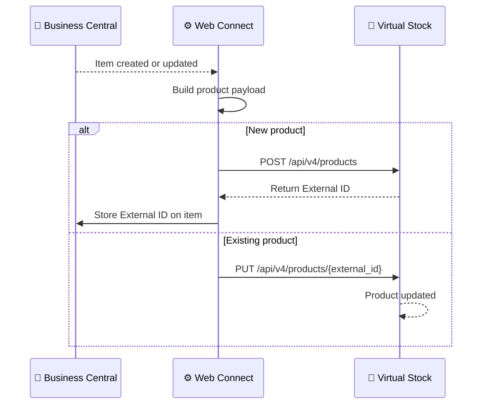

# Product Data Flow

**Direction:** BC → Virtual Stock
**Purpose:** Sync product and item information from Business Central to Virtual Stock so the retailer's catalogue is kept up to date.

---

## Overview

Virtual Stock maintains a product catalogue on behalf of the supplier. Product information — including descriptions, EAN codes, dimensions, images, and pricing — must be pushed from BC (or another source of truth) to Virtual Stock so that the retailer can display and sell the products.

Each product in Virtual Stock is identified by an **External ID** assigned by Virtual Stock at the time of product creation.

---

## Variants

### Variant A — REST API via Web Connect

Product data is pushed to Virtual Stock via the REST API using Web Connect. This enables real-time or near-real-time product updates.

**Trigger:** Configurable — can be triggered by item changes in BC or run as a scheduled batch
**API endpoints:**
- `POST /api/v4/products` — create new product
- `PUT /api/v4/products/{external_id}` — update existing product
- `POST /api/v4/products/{external_id}/stock` — update stock (see [Stock Update](stock-update.md))

**Objects used:**

| Object | Role |
|---|---|
| `VS_PRODUCT` | Sends product data to Virtual Stock (create or update) |

**Process steps:**

1. Product data changes in BC (or initial sync is triggered)
2. Web Connect detects the change or runs on schedule
3. Product payload built and sent to Virtual Stock
4. If product is new: Virtual Stock creates it and returns an External ID
5. External ID stored in BC or Web Connect for future updates and stock syncing

**Sequence diagram:**

---

### Variant B — CSV via SFTP (batch)

Product data is exported as a CSV file and transferred to Virtual Stock via SFTP. Suitable for large initial loads or when real-time updates are not required.

**Trigger:** Scheduled batch (e.g. nightly)
**Transfer method:** SFTP
**File format:** CSV (Virtual Stock specification)

---

### Variant C — Manual upload via Virtual Stock portal

Product data is uploaded manually via the Virtual Stock portal using a CSV template provided by Virtual Stock. Used for initial setup, one-off updates, or when no automated integration exists.

---

## Configuration Notes

- **External ID:** Virtual Stock assigns an External ID when a product is first created. This ID must be stored and associated with the BC item for all future updates and stock syncs
- **EAN requirement:** Products should have a valid EAN code; this is used for item matching in the order flow
- **Images:** Virtual Stock supports product image URLs; images are typically hosted externally (CDN) and linked by URL rather than uploaded directly
- **Retailer-specific catalogue:** Some retailers may require product data to be submitted through retailer-specific templates or portals rather than directly via the VS API

---

## Error Handling

| Step | What can go wrong | What happens |
|---|---|---|
| Building payload | Missing required fields (EAN, title) | VS API returns validation error |
| Creating product | Duplicate product | VS returns conflict error; update endpoint should be used instead |
| Storing External ID | Not saved after creation | Future updates and stock syncs fail — cannot match product |
| SFTP transfer (Variant B) | File format error | VS rejects file; check CSV spec |

---

**Related:**
[Overview](../overview.md) · [Stock Update](stock-update.md) · [Authentication](../authentication.md)
