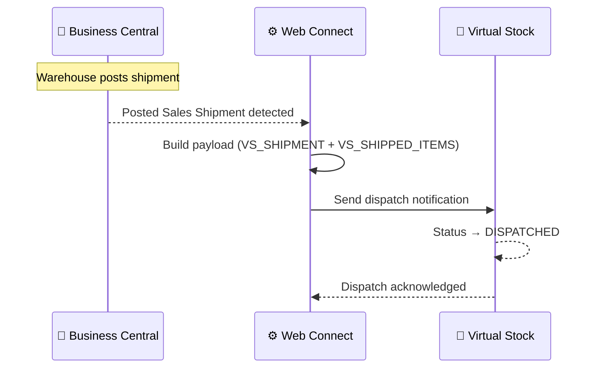

# Shipment / Dispatch Flow

**Direction:** BC → Virtual Stock
**Purpose:** Notify Virtual Stock when an order has been dispatched, moving its status to DISPATCHED.

---

## Overview

Once a Sales Order has been picked, packed, and shipped, a dispatch notification is sent to Virtual Stock. This informs both Virtual Stock and the retailer that the order is on its way, and triggers the final status update to **DISPATCHED**.

The notification includes tracking information and carrier details when available.

---

## Variants

### Variant A — Automatic via Posted Sales Shipment (Standard)

The dispatch notification is sent automatically by Web Connect when a Posted Sales Shipment is detected in BC. No manual action is required.

**Trigger:** Automatic — triggered by Posted Sales Shipment in BC
**Objects used:**

| Object | Role |
|---|---|
| `VS_SHIPMENT` | Parent — sends dispatch notification to Virtual Stock |
| `VS_SHIPPED_ITEMS` | Sub — shipped lines (item, quantity, EAN) |
| `VS_SHIPMENTDATA_FROM_LINE` | Sub — shipment data per line (carrier, tracking, dispatch date) |

**Process steps:**

1. Warehouse picks and packs the order
2. Shipment is posted in Business Central (Posted Sales Shipment)
3. Web Connect detects the posted shipment
4. Dispatch payload built using `VS_SHIPMENT` + `VS_SHIPPED_ITEMS` + `VS_SHIPMENTDATA_FROM_LINE`
5. Dispatch notification sent to Virtual Stock
6. Virtual Stock updates order status to `DISPATCHED`

**Sequence diagram:**

---

### Variant B — Manual dispatch notification

The dispatch notification can be triggered manually from BC or submitted directly via the Virtual Stock portal, if automatic detection is not configured.

---

## Carrier / Delivery Code Mapping

Virtual Stock uses specific delivery codes to identify carriers. These must be mapped from BC shipment methods or carrier codes.

Example mapping (customer-specific — see customer repo):

| BC Carrier | VS Delivery Code |
|---|---|
| DHL Germany | `dhl-germany` |
| DHL Netherlands | `dhl-nl` |
| UPS | `ups` |

The complete list of valid Virtual Stock delivery codes is available in the [Virtual Stock API documentation](https://api-docs.virtualstock.com).

---

## Configuration Notes

- **EAN required per shipped line:** Virtual Stock expects an EAN per line item in the dispatch notification
- **Tracking number:** Included in the payload when available from BC
- **Partial shipments:** Multiple shipments per order are supported; each posted shipment triggers a separate notification

---

## Error Handling

| Step | What can go wrong | What happens |
|---|---|---|
| Detecting posted shipment | WC trigger not set up | Dispatch notification never sent; order stays PROCESSING |
| Building payload | EAN missing on item | Dispatch notification may fail or send incomplete data |
| Sending notification | VS API error | Job Queue entry fails; order stays PROCESSING in VS |
| Sending notification | Auth error (401/403) | Token refresh attempted; if fails, check auth config |

---

**Related:**
[Overview](../overview.md) · [Order — Inbound](order-inbound.md) · [Order Confirmation](order-confirmation.md) · [Authentication](../authentication.md)
