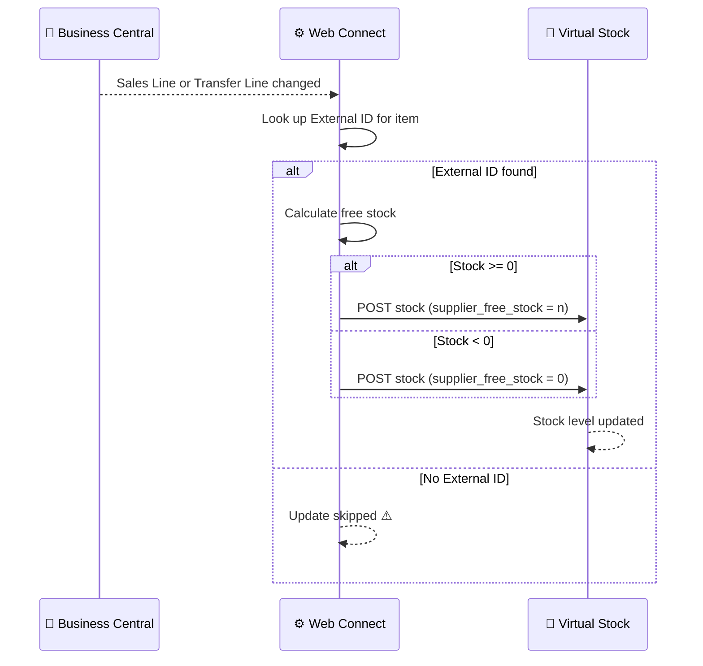

# Stock Update Flow

**Direction:** BC → Virtual Stock
**Purpose:** Keep stock levels in Virtual Stock in sync with Business Central so the retailer always sees accurate available stock per product.

---

## Overview

Virtual Stock displays supplier stock levels to retailers. When inventory changes in BC — for example when a Sales Order is created or a Transfer Order is posted — Web Connect automatically pushes the updated stock level to Virtual Stock.

Each product in Virtual Stock is identified by an **External ID** (the Virtual Stock product identifier). This ID must be present in BC or Web Connect for the update to reach the correct product in Virtual Stock.

---

## How It Works

**Trigger:** Automatic — field changes on Sales Lines or Transfer Lines in BC
**API endpoint:** `POST /api/v4/products/{external_id}/stock`
**Field sent:** `supplier_free_stock`

**Objects used:**

| Object | Role |
|---|---|
| `VS_STOCKUPDATE` | Sends updated stock level to Virtual Stock |

**Triggered by (Web Connect outgoing sync):**

| Source table | Fields watched | Why |
|---|---|---|
| Sales Line | Quantity (6), Outstanding Qty (15) | Sales order created or changed → free stock changes |
| Transfer Line | Item No. (3), Variant Code (4) | Transfer affects stock allocation |

**Lookup used:** EAN → BC Item No. (configured per customer; variant filter such as `-UK` may apply)

**Process steps:**

1. Sales Line or Transfer Line created or modified in BC
2. Web Connect detects the change via outgoing sync trigger
3. Item is matched to Virtual Stock using the **External ID** — stored on the BC Item Card or in Web Connect → Outgoing Data
4. Current free stock calculated
5. If stock is below zero → `0` is sent (Virtual Stock does not accept negative values)
6. Stock update sent to Virtual Stock

**Sequence diagram:**

---

## Variants

### Variant A — EAN lookup + External ID on Item Card (Standard)

Items are matched using an EAN lookup. The External ID is stored directly on the BC Item Card.

### Variant B — External ID in Web Connect Outgoing Data

The External ID is not on the Item Card but is configured in Web Connect's Outgoing Data mapping. Used when the Item Card cannot be modified or when the mapping is managed centrally in the integration config.

---

## External ID Requirement

Every product that should have its stock synced **must have an External ID configured**. Without it, the stock update is silently skipped — Virtual Stock is not updated.

The External ID is assigned by Virtual Stock when the product is first created there (see [Product Data](product-data.md)).

---

## Configuration Notes

- **Negative stock:** Always sent as `0`
- **Scope:** Only items with a matching External ID are synced
- **Trigger priority:** Web Connect — short Job Queue delay between change and update (typically seconds)

---

## Error Handling

| Step | What can go wrong | What happens |
|---|---|---|
| Item matching | No External ID | Update silently skipped; VS stock not updated |
| Item matching | Incorrect External ID | Update sent to wrong product in VS |
| Sending update | VS API error | Job Queue entry fails; retried on next run |
| Sending update | Auth error (401/403) | Token refresh attempted; if fails, check `VS_OAUTH` config |

---

**Related:**
[Overview](../overview.md) · [Product Data](product-data.md) · [Authentication](../authentication.md)
