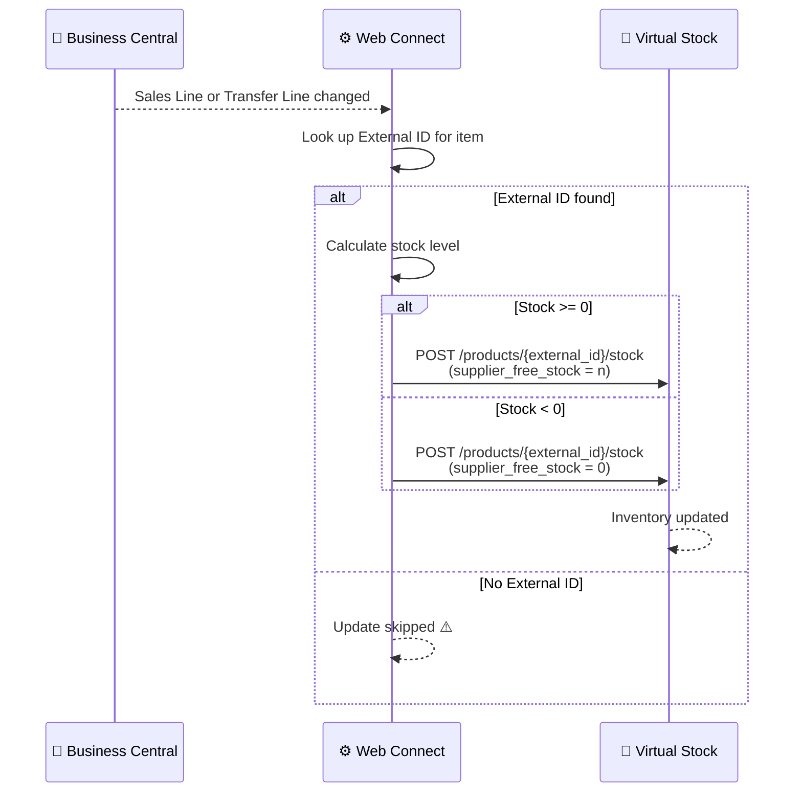

# Stock Update Flow

**Direction:** BC → Virtual Stock
**Purpose:** Keep stock levels in Virtual Stock in sync with Business Central, so the retailer always sees accurate available stock per product.

---

## Overview

Virtual Stock displays supplier stock levels to retailers. This information must be kept up to date so retailers can accurately present product availability. The stock level sent to Virtual Stock is the supplier's free stock — the quantity available to fulfil new orders.

Each product in Virtual Stock is identified by an **External ID** (the Virtual Stock product identifier). This ID must be present in BC or Web Connect for the update to be sent to the correct product.

---

## Variants

### Variant A — Real-time sync via Web Connect (Standard)

Stock levels are pushed to Virtual Stock automatically when inventory-affecting changes are detected in BC. No manual action is required.

**Trigger:** Automatic — field changes on Sales Lines or Transfer Lines in BC
**API endpoint:** `POST /api/v4/products/{external_id}/stock`
**Field sent:** `supplier_free_stock`

**Objects used:**

| Object | Role |
|---|---|
| `VS_STOCKUPDATE` | Sends updated stock level to Virtual Stock |

**Triggered by (Web Connect outgoing sync):**

| Source table | Fields watched |
|---|---|
| Sales Line | Quantity (field 6), Outstanding Qty (field 15) |
| Transfer Line | Item No. (field 3), Variant Code (field 4) |

**Lookup used:** EAN → BC Item No. (variant filter: `-UK`)

**Process steps:**

1. Sales Order line or Transfer Order line is created or modified in BC
2. Web Connect detects the change via outgoing sync trigger
3. Item is matched to Virtual Stock using the **External ID** — stored on the Item Card in BC or in Web Connect → Outgoing Data
4. Stock level calculated using Web Connect Item Inventory logic
5. Negative stock check — if calculated level is below zero, `0` is sent instead
6. Stock update sent to Virtual Stock via `VS_STOCKUPDATE`

**Sequence diagram:**

---

### Variant B — Batch update via flat file (CSV/SFTP)

Stock levels are exported as a CSV file and transferred to Virtual Stock via SFTP on a scheduled basis. This is an alternative to the real-time REST API approach, suited for systems that cannot push changes in real time.

**Trigger:** Scheduled batch export (e.g. nightly or hourly)
**Transfer method:** SFTP
**File format:** CSV (Virtual Stock specification)

---

### Variant C — Manual update via Virtual Stock portal

Stock levels are entered or uploaded manually in the Virtual Stock portal. Used when no automated integration exists or as a temporary measure during go-live or incidents.

---

## External ID Requirement

For Variant A, every product that should have its stock synced to Virtual Stock **must have an External ID configured**. Without it, the update is silently skipped and Virtual Stock stock is not updated.

The External ID can be stored in two places:
1. **BC Item Card** — directly on the item
2. **Web Connect → Outgoing Data** — mapped per item in the integration config

---

## Configuration Notes

- **Negative stock:** Always sent as `0` (Virtual Stock does not accept negative values)
- **Scope:** Only items with a matching External ID are synced
- **Trigger priority:** Web Connect priority 2 — short Job Queue delay between change and update

---

## Error Handling

| Step | What can go wrong | What happens |
|---|---|---|
| Item matching | No External ID on item | Update silently skipped — VS stock not updated |
| Item matching | Incorrect External ID | Update sent to wrong product in VS |
| Sending update | VS API unreachable | Job Queue entry fails; retried on next run |
| Sending update | Auth error (401/403) | Token refresh attempted; if fails, check auth config |

---

**Related:**
[Overview](../overview.md) · [Order — Inbound](order-inbound.md) · [Authentication](../authentication.md)
