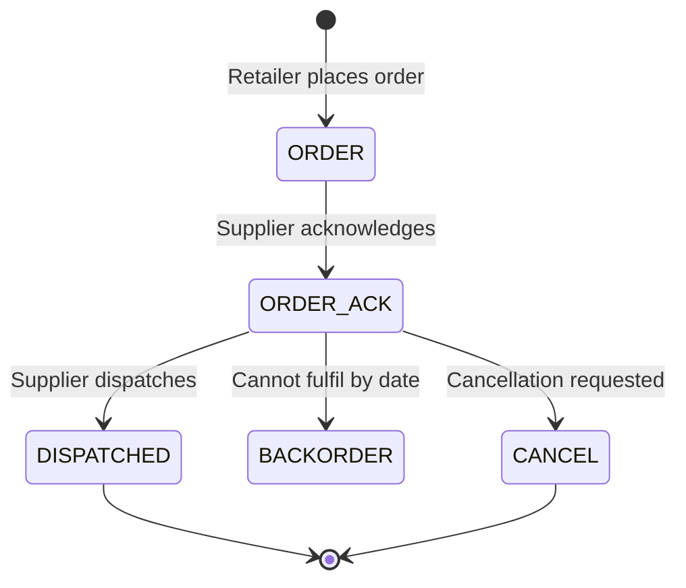

# Virtual Stock — Integration Overview

## What is Virtual Stock?

Virtual Stock is a modular SaaS platform that sits between retailers and their suppliers. It is predominantly used as a dropship solution, enabling suppliers to receive orders from retailers and send back order confirmations, shipment details and stock availability.

**API reference:** [api-docs.virtualstock.com](https://api-docs.virtualstock.com)
**API version used:** V4 (REST)
**Rate limit:** 250 requests per minute

---

## Available Flows

| Flow | Direction | Description |
|---|---|---|
| [Order — Inbound](flows/order-inbound.md) | Virtual Stock → BC | Receive orders from retailer via Virtual Stock |
| [Order Confirmation](flows/order-confirmation.md) | BC → Virtual Stock | Acknowledge receipt of order |
| [Shipment / Dispatch](flows/shipment.md) | BC → Virtual Stock | Notify Virtual Stock when order is dispatched |
| [Stock Update](flows/stock-update.md) | BC → Virtual Stock | Keep stock levels in sync |
| [Cancellation](flows/cancellation.md) | BC → Virtual Stock | Cancel an acknowledged order |
| [Product Data](flows/product-data.md) | BC → Virtual Stock | Sync product/item information |

---

## Order Status Lifecycle

| Status key | Label | Description |
|---|---|---|
| `ORDER` | New Order | Sent to supplier, not yet acknowledged |
| `ORDER_ACK` | Processing | Supplier has acknowledged |
| `BACKORDER` | On Backorder | Cannot fulfil by expected date; new date provided |
| `CANCEL` | Cancellation Requested | Retailer has requested cancellation |
| `DISPATCHED` | Dispatched | Order shipped by supplier |

---

## Integration Methods

Virtual Stock supports multiple integration methods. Web Connect uses REST API for all flows.

| Method | Use case |
|---|---|
| REST API (V4) | Real-time order management, stock updates, dispatch |
| Flat file CSV via SFTP | Batch-based alternative to REST API |
| Webhook | Retailer receives tracking updates pushed by Virtual Stock |
| JSON via SFTP | Invoice delivery to retailers |

---

## Authentication

See [Authentication](authentication.md) for all supported methods.

---

## Related

[Authentication](authentication.md) · [API Reference](https://api-docs.virtualstock.com)
