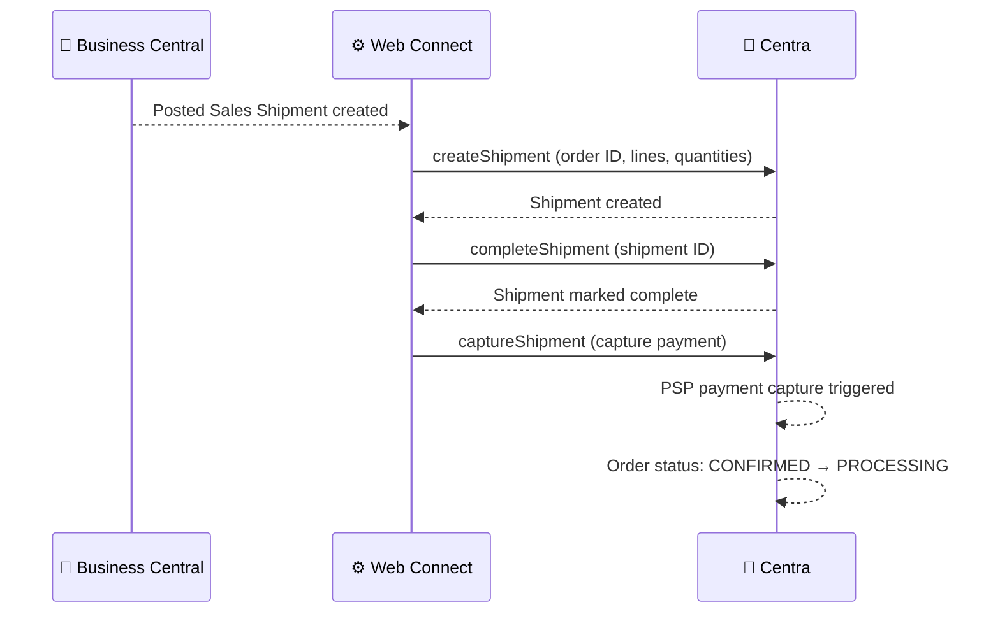

# Shipment Flow

**Direction:** BC → Centra
**Purpose:** Notify Centra when orders are shipped and trigger payment capture.

---

## Overview

When an order is shipped in Business Central, Web Connect automatically sends shipment details to Centra. This updates the order status and can trigger payment capture by the payment service provider.

The flow involves three steps:
1. **Create shipment** — Record which items are being shipped
2. **Complete shipment** — Mark the shipment as complete
3. **Capture payment** — Trigger payment authorization/capture (if configured)

---

## How It Works

**Trigger:** Posted Sales Shipment created in BC
**API operations:** `createShipment` → `completeShipment` → `captureShipment`

**Objects used:**

| Object | Role |
|---|---|
| `CA_SHIPMENT` | Creates shipment record in Centra |
| `CA_SHIPMENTINPUT` | Specifies which order lines are shipped |
| `CA_SHIPMENTINFO` | Carrier, tracking number, shipment date |
| `CA_CONFIRM_SHIPPEDORDER` | Completes the shipment |
| `CA_CAPTURESHIPMENT` | Triggers payment capture |

**Process steps:**

1. Warehouse posts a Sales Shipment in BC
2. Web Connect detects the shipment creation
3. Web Connect sends `createShipment` to Centra with item quantities and dates
4. Centra confirms shipment received → order status: CONFIRMED → PROCESSING
5. Web Connect sends `completeShipment` to mark shipment as done
6. Web Connect sends `captureShipment` to trigger PSP payment capture
7. Payment is authorized/captured by Centra's payment provider
8. Order moves toward `COMPLETED` status once all lines are shipped

**Sequence diagram:**

---

## Variants

### Variant A — Full Shipment with Capture (Standard)

All ordered items are shipped and payment is captured in one transaction.

### Variant B — Partial Shipments

Only some items are shipped. The remaining items stay allocated until a subsequent shipment or cancellation.

### Variant C — Shipment Without Capture

Some customers handle payment separately and do not want automatic capture triggered.

---

## Configuration Notes

- **Shipment trigger:** Posted Sales Shipment (table 110) detects when goods are shipped
- **Carrier/tracking:** Shipping agent and service codes can be included if configured
- **Multiple shipments:** An order can have multiple shipments — each is sent to Centra separately

---

## Error Handling

| Step | What can go wrong | What happens |
|---|---|---|
| Detecting shipment | Web Connect not monitoring Sales Shipment | Shipment is never sent to Centra |
| Creating shipment | Order not CONFIRMED in Centra | API returns error; shipment not created |
| Completing shipment | Centra API unavailable | Job Queue entry fails; retried on next run |
| Capturing payment | PSP unavailable or auth expired | Capture fails; warning returned but shipment is recorded |

---

**Related:**
[Overview](../overview.md) · [Order — Inbound](order-inbound.md) · [Cancellation](cancellation.md) · [How-to](../../../../../how-to/web-connect/README.md)
