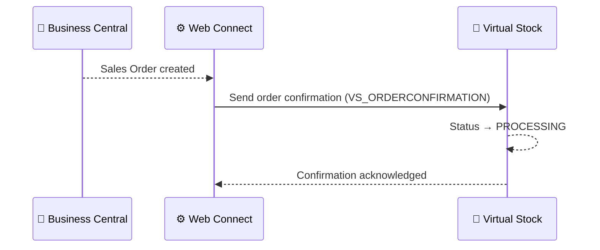

# Order Confirmation Flow

**Direction:** BC → Virtual Stock
**Purpose:** Acknowledge receipt of an order to Virtual Stock, moving its status from PENDING to PROCESSING.

---

## Overview

After a Sales Order is created in BC (see [Order — Inbound](order-inbound.md)), an order confirmation is sent back to Virtual Stock automatically by Web Connect. This tells Virtual Stock — and the retailer — that the supplier has received and accepted the order.

Virtual Stock moves the order status from **PENDING** to **PROCESSING** upon receipt.

---

## How It Works

**Trigger:** Automatic — triggered by Sales Order creation in BC (no manual action required)

**Objects used:**

| Object | Role |
|---|---|
| `VS_ORDERCONFIRMATION` | Parent — sends confirmation to Virtual Stock |
| `VS_CONFIRMATION_ITEM` | Sub — confirmed order lines |

**Process steps:**

1. Sales Order created in BC (from [Order — Inbound](order-inbound.md))
2. Web Connect detects the new Sales Order
3. Confirmation payload built from `VS_ORDERCONFIRMATION` + `VS_CONFIRMATION_ITEM`
4. Confirmation sent to Virtual Stock
5. Virtual Stock updates order status to `PROCESSING`

**Sequence diagram:**

---

## Variants

### Variant A — Full order confirmation (Standard)

All lines on the Sales Order are confirmed in a single confirmation message.

### Variant B — Confirmation with expected date per line

The confirmation includes an expected dispatch or delivery date per order line. Used when the retailer requires date commitments upfront.

---

## Configuration Notes

- **Expected date:** Optional field; can be included per line in the confirmation
- **Partial confirmation:** Virtual Stock supports confirming individual lines; whether this is used depends on customer setup

---

## Error Handling

| Step | What can go wrong | What happens |
|---|---|---|
| Sending confirmation | VS API error | Job Queue entry fails; order stays `PENDING` in VS |
| Sending confirmation | Auth error (401/403) | Token refresh attempted; if fails, check `VS_OAUTH` config |
| Sending confirmation | Order already confirmed | VS returns error; check for duplicate processing |

---
**Related:**
[Overview](../overview.md) · [Order — Inbound](order-inbound.md) · [Shipment / Dispatch](shipment.md) · [How-to](../../../../../how-to/web-connect/README.md)
