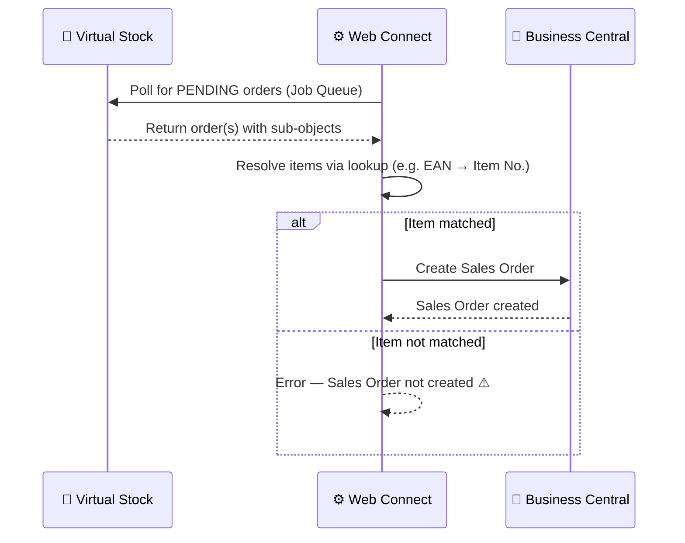

# Order — Inbound Flow

**Direction:** Virtual Stock → BC
**Purpose:** Fetch new orders from Virtual Stock and create them as Sales Orders in Business Central.

---

## Overview

Virtual Stock sits between the retailer and the supplier (BC). When a retailer places an order, it becomes available in Virtual Stock with status **PENDING**. Web Connect polls Virtual Stock at regular intervals and creates a corresponding Sales Order in BC.

---

## How It Works

**Trigger:** Job Queue — Web Connect polls Virtual Stock on a scheduled interval (configurable per customer)
**Condition:** Orders with status `PENDING` only

**Objects used:**

| Object | Role |
|---|---|
| `VS_ORDER` | Parent — fetches order header from Virtual Stock |
| `VS_ORDERITEMS` | Sub — order lines (item, quantity, price, promised date) |
| `VS_ADDRESS` | Sub — billing/contact address |
| `VS_SHIPPING_ADDRESS` | Sub — delivery address (name, address, postal code, country, email, phone) |
| `VS_RETAILER_DATA` | Sub — retailer details (name, address, email, phone, tax code, VS UUID) |

**Process steps:**

1. Job Queue triggers Web Connect polling
2. Web Connect fetches all orders with status `PENDING` from Virtual Stock
3. Sub-objects resolve to build the full order payload
4. Each item is matched to a BC Item No. using the configured lookup (e.g. EAN → Item No.)
5. Sales Order created in BC
6. Order confirmation sent automatically (see [Order Confirmation](order-confirmation.md))

**Sequence diagram:**

---

## Variants

### Variant A — EAN → Item No. lookup (Standard)

Items on the incoming order are matched using an EAN-to-BC Item No. lookup table configured in Web Connect. A variant code filter (e.g. `-UK`) can be applied.

### Variant B — Direct Item No. from retailer

If the retailer sends the supplier's own item reference (instead of EAN), the lookup step is bypassed and the item is matched directly.

---

## Configuration Notes

- **Polling interval:** Configured per customer in the Job Queue
- **Item lookup:** Must be configured — see customer repo for the specific lookup used
- **Order status filter:** Standard is `PENDING`; other statuses are not fetched

---

## Error Handling

| Step | What can go wrong | What happens |
|---|---|---|
| Polling | VS API unreachable | Job Queue entry fails; retried on next run |
| Polling | Auth error (401/403) | Token refresh attempted; if fails, check `VS_OAUTH` config |
| Item matching | EAN not found | Sales Order creation fails; entry logged with error |
| Sales Order creation | BC error | Job Queue entry fails with error message |

---
**Related:**
[Overview](../overview.md) · [Order Confirmation](order-confirmation.md) · [How-to](../../../../../how-to/web-connect/README.md)
