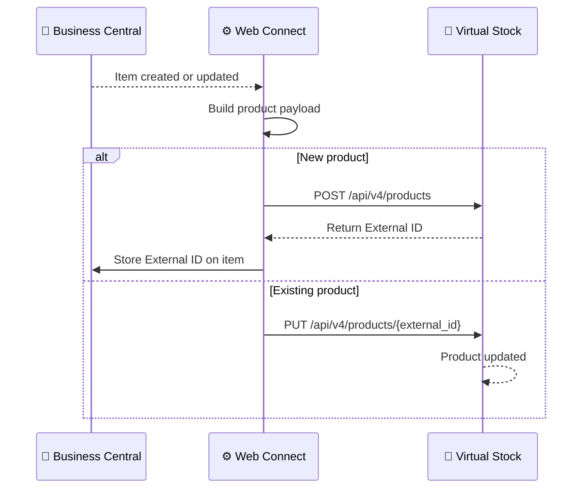

# Product Data Flow

**Direction:** BC → Virtual Stock
**Purpose:** Sync product information from Business Central to Virtual Stock so the retailer's catalogue is up to date.

---

## Overview

Before orders can flow through the integration, products must exist in Virtual Stock. Product information — such as item references, EAN codes, descriptions, and dimensions — is pushed from BC to Virtual Stock via Web Connect. Virtual Stock assigns each product an **External ID** which is stored back in BC and used for all subsequent stock updates.

---

## How It Works

**Trigger:** Configurable — can be triggered by item creation/changes in BC or run as an initial one-time sync
**API endpoints:**
- `POST /api/v4/products` — create new product
- `PUT /api/v4/products/{external_id}` — update existing product

**Objects used:**

| Object | Role |
|---|---|
| `VS_PRODUCT` | Sends product data to Virtual Stock (create or update) |

**Process steps:**

1. Item created or changed in BC (or initial sync is triggered)
2. Web Connect detects the change
3. Product payload built and sent to Virtual Stock
4. If the product is new: Virtual Stock creates it and returns an **External ID**
5. External ID stored in BC (on Item Card) or in Web Connect Outgoing Data
6. External ID is now available for [Stock Updates](stock-update.md)

**Sequence diagram:**

---

## Variants

### Variant A — Initial sync + ongoing updates (Standard)

An initial sync pushes all relevant items from BC to Virtual Stock. After that, Web Connect detects item changes and pushes updates automatically.

### Variant B — Initial sync only

Used when the product catalogue is stable and items rarely change. An initial sync is run once; subsequent updates are handled manually or via periodic re-sync.

---

## Configuration Notes

- **External ID:** Assigned by Virtual Stock at product creation time. Must be stored and linked to the BC item — required for all stock updates
- **EAN:** Should be present on every item; used for item matching in the order flow
- **Retailer-specific requirements:** Some retailers require product data in a specific format or with specific fields. Confirm with Virtual Stock onboarding documentation

---

## Error Handling

| Step | What can go wrong | What happens |
|---|---|---|
| Building payload | Missing required fields | VS API returns validation error |
| Creating product | Product already exists | VS returns conflict; use update endpoint instead |
| Storing External ID | Not saved after creation | Stock updates fail — cannot match product in VS |

---
**Related:**
[Overview](../overview.md) · [Stock Update](stock-update.md) · [How-to](../../../../../how-to/web-connect/README.md)
