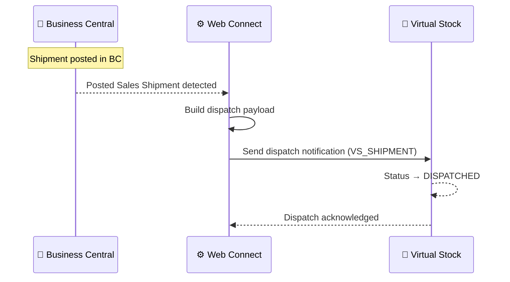

# Shipment / Dispatch Flow

**Direction:** BC → Virtual Stock
**Purpose:** Notify Virtual Stock when an order has been dispatched, moving its status to DISPATCHED.

---

## Overview

Once a Sales Order has been picked, packed, and shipped, Web Connect automatically sends a dispatch notification to Virtual Stock when a Posted Sales Shipment is detected in BC. This informs Virtual Stock — and the retailer — that the order is on its way.

---

## How It Works

**Trigger:** Automatic — triggered by Posted Sales Shipment in BC (no manual action required)

**Objects used:**

| Object | Role |
|---|---|
| `VS_SHIPMENT` | Parent — sends dispatch notification to Virtual Stock |
| `VS_SHIPPED_ITEMS` | Sub — shipped lines (item, quantity, EAN) |
| `VS_SHIPMENTDATA_FROM_LINE` | Sub — shipment data per line (carrier, tracking number, dispatch date) |

**Process steps:**

1. Shipment is posted in Business Central (Posted Sales Shipment)
2. Web Connect detects the posted shipment
3. Payload built from `VS_SHIPMENT` + `VS_SHIPPED_ITEMS` + `VS_SHIPMENTDATA_FROM_LINE`
4. Dispatch notification sent to Virtual Stock
5. Virtual Stock updates order status to `DISPATCHED`

**Sequence diagram:**

---

## Variants

### Variant A — Tracking number from BC (Standard)

Tracking number and carrier are read from the shipment or carrier setup in BC and included in the dispatch notification.

### Variant B — No tracking number

Dispatch notification is sent without tracking information when tracking is not available in BC. The retailer is informed that the order has been dispatched but receives no tracking link.

---

## Carrier / Delivery Code Mapping

Virtual Stock uses specific delivery codes to identify carriers. These must be mapped from BC shipment methods to the Virtual Stock format.

The mapping is configured per customer in Web Connect. Example:

| BC Carrier | VS Delivery Code |
|---|---|
| DHL Germany | `dhl-germany` |
| DHL Netherlands | `dhl-nl` |
| UPS | `ups` |

See the customer repo for the specific carrier mapping in use.

---

## Configuration Notes

- **EAN required per line:** Virtual Stock expects an EAN per shipped line
- **Partial shipments:** Multiple Posted Sales Shipments per order are supported — each triggers a separate dispatch notification
- **Carrier mapping:** Must be configured in Web Connect; unrecognised carriers may cause VS to reject the notification

---

## Error Handling

| Step | What can go wrong | What happens |
|---|---|---|
| Detecting posted shipment | Trigger not configured | Notification never sent; order stays `PROCESSING` in VS |
| Building payload | EAN missing on item | Dispatch notification may fail or send incomplete data |
| Sending notification | VS API error | Job Queue entry fails; order stays `PROCESSING` in VS |
| Sending notification | Auth error (401/403) | Token refresh attempted; if fails, check `VS_OAUTH` config |

---
**Related:**
[Overview](../overview.md) · [Order Confirmation](order-confirmation.md) · [How-to](../../../../../how-to/web-connect/README.md)
